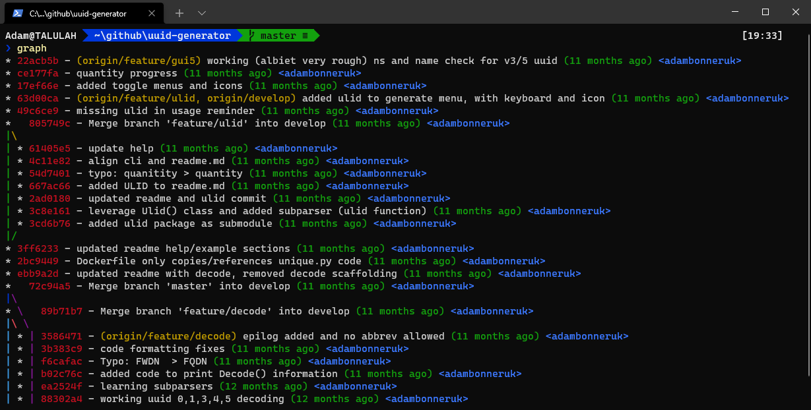

# Config-PowerShell
My Windows PowerShell configuration, including posh-git and useful aliases, I spend a lot of time in the Windows Terminal so having this configuration (publicly) available for different machines is useful.

## Git Setup
```ps
Install-Module posh-git -Scope CurrentUser
Install-Module oh-my-posh -Scope CurrentUser
Install-Module -Name PSReadLine -AllowPrerelease -Scope CurrentUser -Force -SkipPublisherCheck
```

## Preview


## Useful Links
- https://www.hanselman.com/blog/how-to-make-a-pretty-prompt-in-windows-terminal-with-powerline-nerd-fonts-cascadia-code-wsl-and-ohmyposh